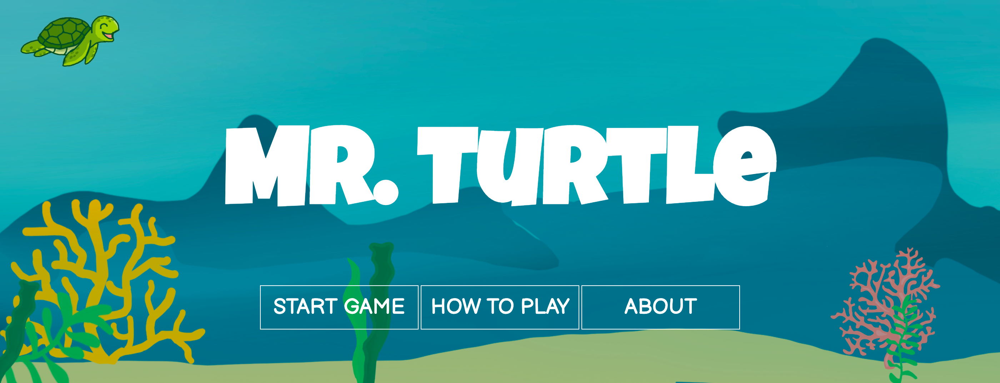
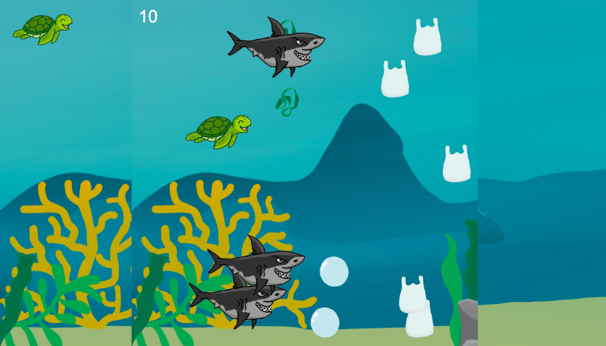

<!-- PROJECT LOGO -->
 

  

  <h3 align="center">Mr. Turtle</h3>

  

    Clean up the ocean while learning facts about plastic pollution as you navigate the waters as Mr. Turtle!
     
    <a href="https://mr-turtle.web.app/"><strong>Play game »</strong></a>
     
     
    <a href="https://devpost.com/software/mr-turtle">Devpost</a>
    ·
    <a href="https://github.com/lumamoto/mr-turtle/issues">Report Bug</a>
    ·
    <a href="https://github.com/lumamoto/mr-turtle/issues">Request Feature</a>
  

<!-- ABOUT THE PROJECT -->
## About The Project

Mr. Turtle is a game where the player must help a turtle navigate through the ocean and collect plastic bags to return them to a diver. Along the way, the player can pop bubbles to earn bonus points and learn a fact about plastic pollution in the ocean. But watch out for tangled seaweed and sharks!

Mr. Turtle was ideated and developed in 41 hours at Hydrangea Hacks 2021.

### Inspiration

Mr. Turtle is inspired by the thousands of sea turtles and marine aquatic life that suffer as a result of ocean pollution. Humans have increased the amount of trash disposed of each year with an average of 3.5 million tons per day. This number is increasing rapidly as each year passes. To highlight the importance of recycling and reducing waste, Mr. Turtle is a game, suitable for all ages, to see the harmful effects of plastic in the ocean. 

The Earth is a magnificent creation and provides us with many resources. It is our duty to maintain and preserve it for future generations. It is not only humans that live on Earth but also billions of other living things that all depend on the environment. Therefore, we should emphasize the importance of environmentally friendly products and reducing plastic usage. 

Education and entertainment is the best way for people to learn something so we hope that Mr. Turtle will teach everyone about water pollution along with environmental pollution as a whole. If turtles can help, then so can you.

### Built With

* [Phaser 3](https://www.phaser.io/)
* HTML
* CSS
* [Figma](https://www.figma.com/)
* [Procreate](https://procreate.art/)
* [EchoAR](https://www.echoar.xyz/)
* [Animaker](https://www.animaker.com/)
* [Firebase Hosting](https://firebase.google.com/docs/hosting/)

